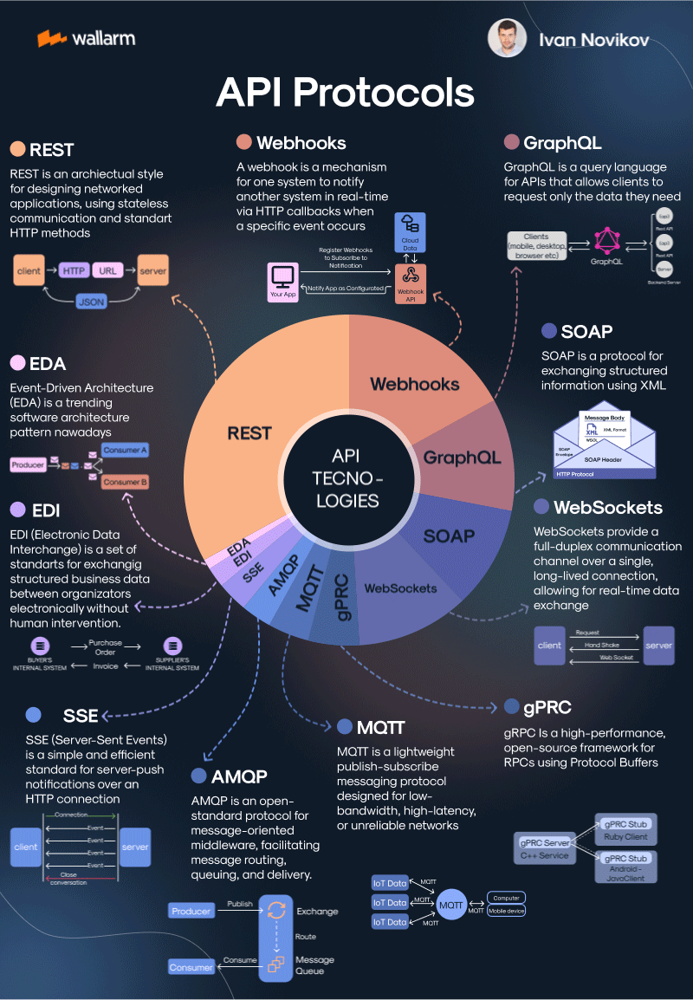

### Overview
A curated collection of API protocols (AMQP, MQTT, gRPC, REST, and more), showcasing real-world use cases with a sleek Streamlit interface. A backend-heavy exploration of modern and legacy API communication.



### Table of Contents
1. Project Description
2. Technologies Used
3. Features
4. API Protocols
5. Installation
6. How to Run
7. Future Enhancements
8. Contributing
9. License

### Project Description
API Aesthetic is designed to be a backend-heavy project aimed at demonstrating the power, use cases, and implementation of various API protocols. While the frontend uses Streamlit for simplicity, the core focus is on understanding and implementing protocols that facilitate communication between services. Each protocol is demonstrated with real-world scenarios and live examples, allowing developers to explore how these protocols function in different contexts.

The project covers popular protocols like REST and GraphQL but also dives into lesser-known but highly useful protocols such as AMQP, MQTT, and gRPC. This project can serve as a learning resource for developers who want to understand and compare the inner workings of various APIs and how to integrate them in real-world applications.

### Technologies Used

#### Backend Frameworks:
* Python (FastAPI, Flask)
* Node.js (Express, for certain services)

#### Frontend:
* Streamlit (for visualization and interaction)

####  Message Brokers:
* RabbitMQ (for AMQP)
* Mosquitto (for MQTT)

#### Real-time Communication:
* WebSockets (Socket.IO)
* Server-Sent Events (SSE)

#### RPC:
* gRPC (with Protocol Buffers)

#### Other Protocols:
* SOAP (with XML)
* REST
* GraphQL

#### Docker: 
* To manage services like RabbitMQ, MQTT broker, and backend components


### Features
* **AMQP (RabbitMQ)**: Demonstrates message queuing, routing, and message consumption between producer and consumer services using RabbitMQ.
* **MQTT (Mosquitto)**: Simulates lightweight communication suitable for IoT applications, using publish-subscribe messaging.
* **gRPC**: Implements high-performance communication between microservices using Protocol Buffers and gRPC.
* **SSE (Server-Sent Events)**: Real-time push notifications from the server to clients over HTTP.
* **SOAP**: Provides structured data exchange using XML via SOAP web services.
* **REST API**: Demonstrates standard CRUD operations using RESTful architecture.
* **GraphQL**: Allows querying and retrieving specific fields using GraphQL.
* **WebSockets**: Provides real-time, bi-directional communication for use cases like live chat or stock price updates.

### API Protocols

| Protocol | Description  | Use Case  |
|--------|---|---|
|AMQP|Advanced Message Queuing Protocol used for message-oriented middleware, with RabbitMQ as the message broker.|Message queuing, event-driven systems.|
|MQTT|Lightweight publish-subscribe protocol, commonly used in IoT applications.|	Real-time sensor data, telemetry.|
|gRPC| High-performance, open-source RPC protocol using Protocol Buffers for structured data exchange.  | Microservices, inter-service communication.  |
|SSE|Server-sent events allow servers to push real-time updates to clients over HTTP.|Real-time notifications, live feeds.|
|SOAP|XML-based protocol for exchanging structured information.|Legacy systems, enterprise-level data exchange.|
|REST|Popular architectural style for designing APIs using HTTP.|CRUD operations, modern web services.|
|GraphQL|Query language for APIs that allows clients to request exactly the data they need.|Efficient data fetching, flexible APIs.|
|WebSockets|Provides full-duplex communication between client and server over a single connection.|Real-time communication, live chat, stock updates.|


### Installation

#### Prerequisites:
* Python 3.8+ (for backend and Streamlit frontend)
* Docker & Docker Compose (for RabbitMQ, MQTT broker, etc.)
* Node.js (optional, if using Node-based services)

#### Steps:

#### Clone the repository:

```
git clone https://https://github.com/mrutunjay-kinagi/api-aesthetic.git
cd api-aesthetic
```

#### Set up virtual environment (for Python backend):
```python3 -m venv venv
source venv/bin/activate
```

#### Install Python dependencies:
```
pip install -r requirements.txt
```

#### Set up and run Docker services (for RabbitMQ, MQTT broker, etc.):
```
docker-compose up -d
```

#### How to Run

#### Backend:
####  To run the backend services (RabbitMQ, MQTT, gRPC, etc.):
```
# AMQP, MQTT, gRPC, etc.
python backend/amqp/producer.py  # To start RabbitMQ producer
python backend/amqp/consumer.py  # To start RabbitMQ consumer
```

#### For the gRPC server:

```
python backend/grpc/server.py  # To start the gRPC server
```

#### For SSE:
```
python backend/sse/server.py  # To start the SSE server
```

#### Frontend (Streamlit):
#### To launch the Streamlit interface for interacting with the APIs:
```
streamlit run frontend/streamlit/app.py
```

### Future Enhancements
* Add OAuth2.0 or JWT-based authentication to secure API endpoints.
* Integrate Kafka for large-scale event-driven architectures.
* Add more real-time visualizations for WebSockets, SSE, and MQTT.
* Incorporate testing (unit and integration tests) for all API protocols using tools like Postman, pytest, or Mocha.

### Contributing
Contributions are welcome! If you'd like to contribute, please fork the repository and make a pull request.
* Fork the Project
* Create your Feature Branch (git checkout -b feature/YourFeature)
* Commit your Changes (git commit -m 'Add Your Feature')
* Push to the Branch (git push origin feature/YourFeature)
* Open a Pull Request

### License
This project is licensed under the MIT License. See the LICENSE file for details.